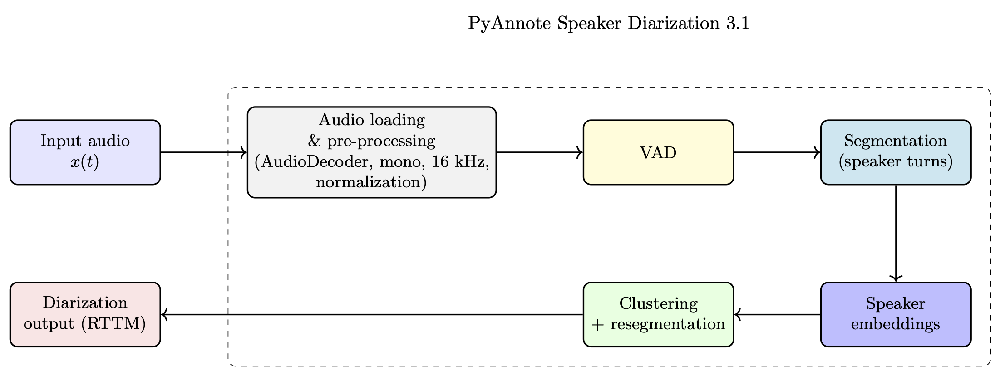
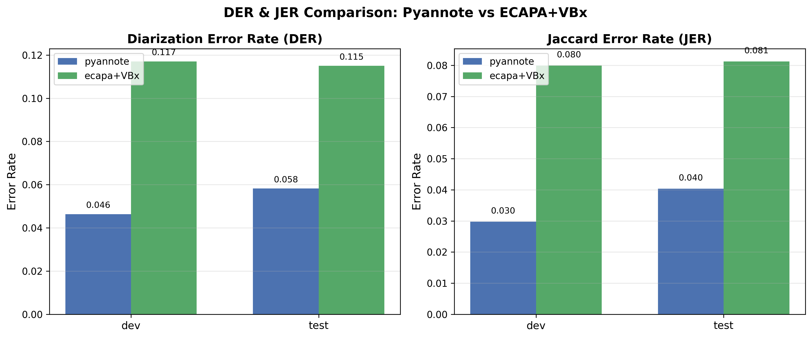
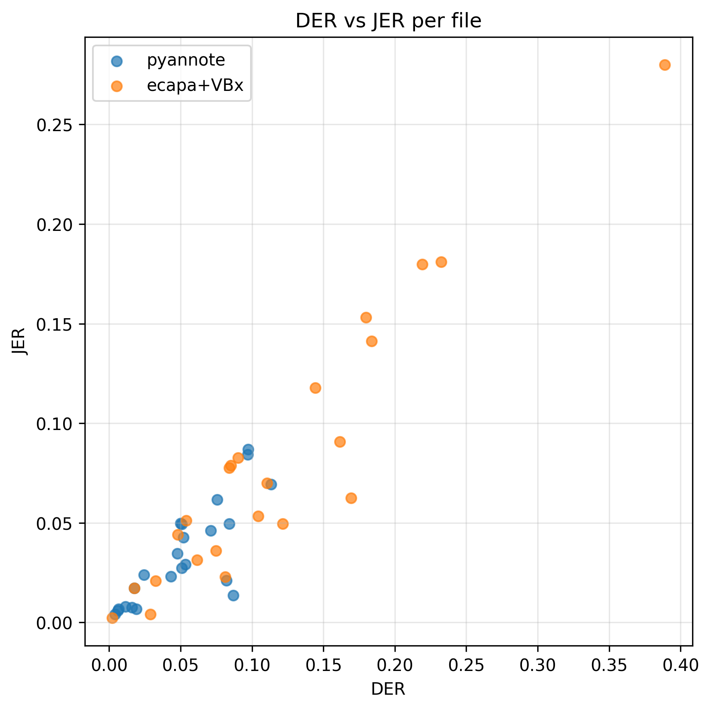

# 🎙️ Speaker Diarization Pipeline  
### ECAPA-TDNN + VBx │ PyAnnote (HF)

This repository contains a complete and extensible **speaker diarization system** that integrates two SOTA pipelines:

- **PyAnnote Speaker Diarization 3.1 (HF)**
- **ECAPA-TDNN + VBx** (Agglomerative clustering with HMM resegmentation)

The project includes:
✔ Embedding extraction  
✔ VAD  
✔ Clustering  
✔ RTTM generation  
✔ DER/JER evaluation  
✔ Result visualizations  

### Folder Structure

- config.py                   # Global experiment config 
- utils.py                    # RTTM writing, helpers  
- metrics.py                  # DER/JER computation  
- ecapa_vbx_run.py            # ECAPA embeddings 
- pyannote_run.py             # PyAnnote diarization pipeline
- main_ecapa_vbx.ipynb        # Run ECAPA+VBx diarization  
- main_pyannote.ipynb         # Run Pyannote diarization  
- eval.ipynb                  # Evaluation + plotting (DER/JER)

### Dataset
This project uses a subset of the VoxConverse dataset — a real-world, multi-speaker conversational audio corpus widely used for speaker diarization research. To keep experiments lightweight and reproducible, a small curated subset of VoxConverse was used:

| Split |  Audio Files  | Description |
|-------|--------------:|-------------|
| **Dev**  | 15 files | Used for model comparison and tuning |
| **Test** | 8 files  | Used for final evaluation and reporting |

### Requirements

- torch==2.1.2
- torchaudio==2.1.2
- transformers==4.37.0
- huggingface_hub
- pyannote.audio==3.1.1
- pyannote.core
- pyannote.metrics

### Methodology:

PyAnnote pipeline

  

ECAPA-TDNN pipeline:

  

### Results:

Below is the comparison of **Diarization Error Rate (DER)** and **Jaccard Error Rate (JER)** on the dev and test splits, where **PyAnnote** produces cleaner speaker boundaries, fewer speaker confusions, and is significantly more robust.

  

This scatter plot visualizes the relationship between **DER** and **JER** for every individual audio file in the dataset.  
Blue (**PyAnnote**) points cluster tightly near the lower-left corner (low DER + low JER), indicating **stable and reliable diarization performance** across all files.

  

